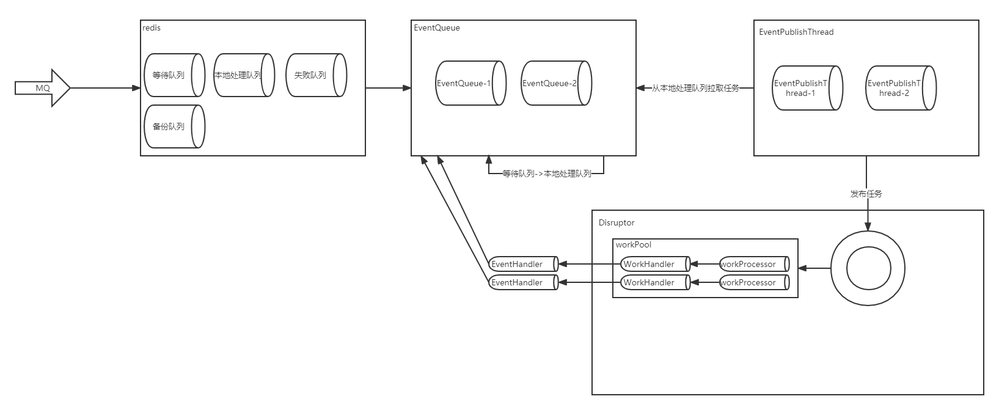

# 异步worker组件

## 背景

- BlockingQueue内存锁性能低
- 内存存储任务不稳定性，如果使用关系型数据库读写有瓶颈
- 串行遍历执行任务吞吐低，资源占用释放缓慢，有峰值危险

## 思路

- 使用Disruptor代替BlockingQueue
- redis队列存储任务，并分级多任务队列，各司其职
  - 原始queue负责接收外部到达物理机的任务
  - 本地处理队列负责记录当前物理机正在处理的任务
  - 失败队列负责记录当前物理机重试达到阈值之后的任务，一般需要人工介入，或者开定时任务去补偿
  - 备份队列，在写原始queue的同时，如果这里需要回溯任务(比如发现代码bug，或者有即时的新需求等)，那么写等待队列的同时需要写备份队列
- 使用Disruptor内存队列接收redis队列，处理任务
- 组件中暴露外部配置的参数不多，可以根据自身需求增加

## 组成分析

### EventWorker

- 初始化Disruptor
  - WorkHandler负责分配任务的时候，协调EventQueue与EventHandler关系
- 记录EventQueue与EventHandler关系
- 初始化发布Disruptor任务的线程池
- 初始化Disruptor eventProcessor线程池

### ExceptionHandler

- Disruptor的异常处理

### DefaultEventTranslator

- 默认的事件属性填充器

### DefaultEventFactory

- 事件工厂类

### EventQueue

- redis待消费队列与本地队列的桥梁
- EventHandler处理业务之后回调通知消息状态，做redis队列的流转

### EventHandler

- 核心业务处理

### EventPublishThread

- 本地队列与disruptor内存队列的桥梁